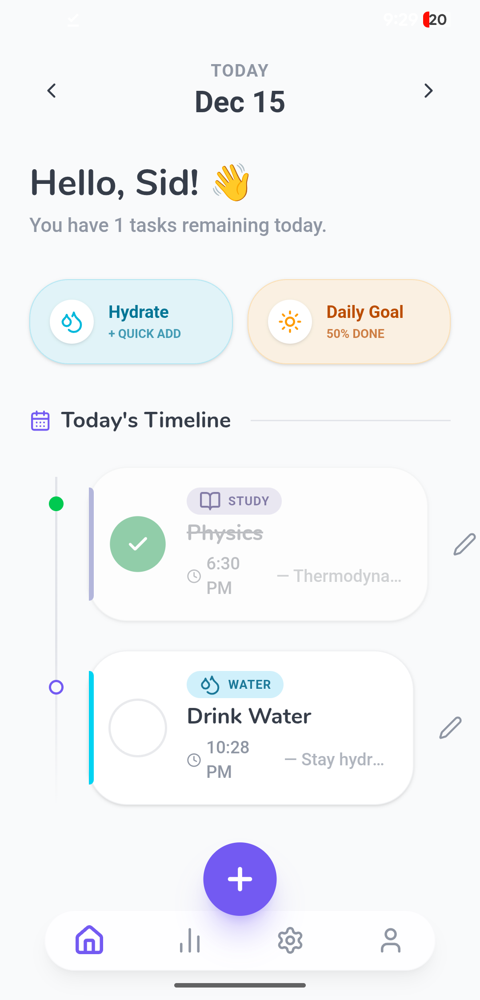
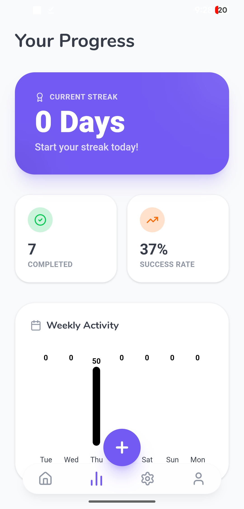

# DailyFlow

**Never miss a beat.**
DailyFlow is a simple, reliable reminder application designed to keep your day organized. Set reminders effortlessly and get notified exactly when you need to be.

---

## Download

Get the latest version of DailyFlow from the Releases.

> **Note:** Since this app is not on the Play Store, you may need to "Allow installation from unknown sources" in your settings when installing.

---

## Features

* **Easy Setup:** Create reminders in seconds.
* **Timely Notifications:** Precise alerts so you never miss a task.
* **Clean Interface:** A minimal, distraction-free design.

---

## Screenshots

| Reminder | Status |
|:---:|:---:|
|  |  |

---

## Installation Guide

1.  Click the **Download APK** button above.
2.  Open the downloaded file (`DailyFlow.apk`).
3.  If prompted, allow permission to install from your browser.
4.  Launch the app and start organizing!

---
